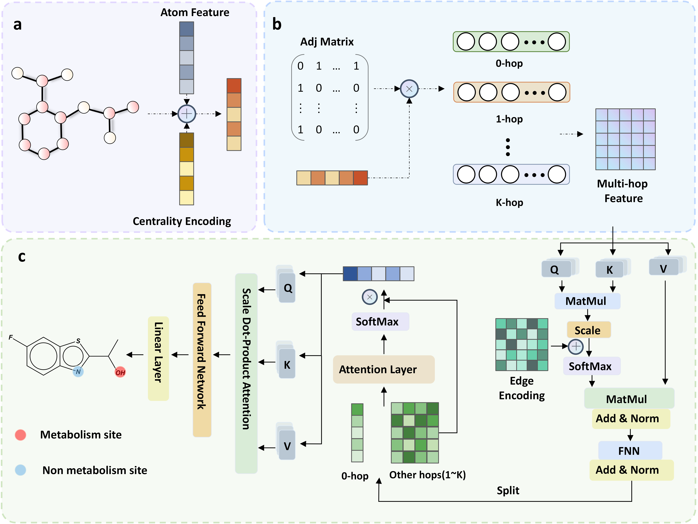

# UGTformer



UGTformer is a graph transformer-based model for drug metabolism prediction, capable of simultaneously performing molecular-level substrate classification and atom-level site of metabolism (SOM) prediction. Self-supervised pretraining on the ZINC15 compound library significantly enhances its predictive performance on both tasks, making it a practical tool for early-stage drug metabolism modeling and risk assessment.

## Environment Setup

Download the repository and create the environment:

```bash
git clone https://github.com/mlzhan923/UGTformer.git
cd ./UGTformer
conda env create -f environment.yml
conda activate UGTformer
```

Install PyTorch (with CUDA 11.8 support) after activating the environment:

```bash
conda install pytorch==2.0.1 torchvision==0.15.2 torchaudio==2.0.2 pytorch-cuda=11.8 -c pytorch -c nvidia
```

## Reproduce the results of UGTformer

We provide the dataset structure in the `dataset/` directory, which includes:
- `train/`: Training dataset used for model fitting
- `val_external/`: External validation dataset used for evaluation

### Pretraining

The pretrained model weights are available in `finetune/pretrained_model.pth`. These weights were obtained through self-supervised pretraining on the ZINC15 compound library, which significantly enhances the model's predictive performance.

If you want to reproduce the pretraining process, use the following command:

```bash
python pretrain/pretrain.py --device 0 --batch_size 512 --epochs 100 --output_model_file ./pretrained_models/ --graph_dir graph_data
```

Key parameters:
- `--device`: CUDA device ID
- `--batch_size`: Batch size for pretraining
- `--epochs`: Number of pretraining epochs
- `--output_model_file`: Directory to save the pretrained model
- `--graph_dir`: Directory containing the graph data for pretraining

### Fine-tuning

To reproduce our fine-tuning results, use the following command:

```bash
python finetune/finetune.py --data_path dataset/train/training_data.csv \
                           --pretrained_model_path finetune/pretrained_model.pth \
                           --save_dir ./checkpoints \
                           --device 0 \
                           --batch_size 32 \
                           --epochs 100
```

Key parameters:
- `--data_path`: Path to the training dataset
- `--pretrained_model_path`: Path to the pretrained model weights
- `--save_dir`: Directory to save the fine-tuned model
- `--device`: CUDA device ID (default: 0)
- `--batch_size`: Batch size for training (default: 32)
- `--epochs`: Number of training epochs (default: 100)

### Evaluation

To evaluate the model on the external validation dataset:

```bash
python finetune/finetune.py --data_path dataset/val_external/external_data.csv \
                           --pretrained_model_path ./checkpoints/model.pth \
                           --device 0 
```

The evaluation will output performance metrics including AUROC, accuracy, F1 score, MCC, sensitivity, and specificity for both substrate classification and SOM prediction tasks.

## Using the Web Server for Prediction

Our web server (https://lmmd.ecust.edu.cn/UGTformer/) provides an accessible interface for UGT-mediated metabolism prediction with the following features:

- **Multiple Input Options**: Enter SMILES strings directly, draw molecules using the embedded Ketcher editor, or upload MOL/SDF files
- **Comprehensive Predictions**: Simultaneously performs substrate classification and site-of-metabolism (SOM) prediction
- **Interactive Visualization**: Color-coded molecular display highlighting potential metabolic sites from blue (low probability) to red (high probability)

The server provides both molecular-level substrate probability and atom-level metabolic risk scores, making it a valuable tool for researchers optimizing lead compounds and investigating UGT-mediated metabolism.

## License

This project is licensed under the [MIT License](LICENSE).